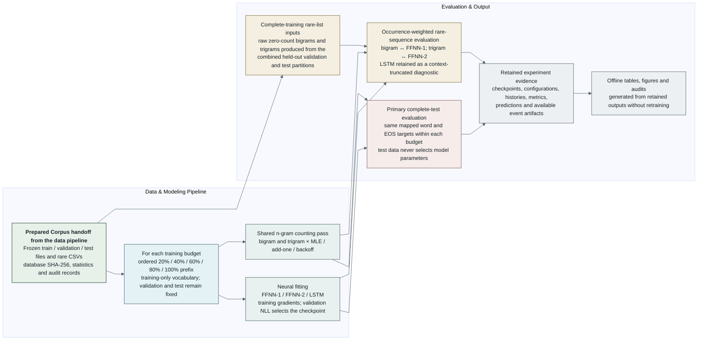

```mermaid
%%{init: {"theme": "base", "flowchart": {"curve": "linear", "htmlLabels": true}, "themeVariables": {"fontFamily": "Arial, sans-serif", "fontSize": "15px", "lineColor": "#56636b", "primaryTextColor": "#172126"}}}%%
flowchart LR
    subgraph Modeling [Data & Modeling Pipeline]
        direction TB
        A["<b>Prepared Corpus handoff from the data pipeline</b><br/>Frozen train / validation / test files and rare CSVs<br/>database SHA-256, statistics and audit records"]
        B["For each training budget<br/>ordered 20% / 40% / 60% / 80% / 100% prefix<br/>training-only vocabulary; validation and test remain fixed"]
        N["Neural fitting<br/>FFNN-1 / FFNN-2 / LSTM<br/>training gradients; validation NLL selects the checkpoint"]
        S["Shared n-gram counting pass<br/>bigram and trigram × MLE / add-one / backoff"]

        A --> B
        B --> N
        B --> S
    end

    subgraph Evaluation [Evaluation & Output]
        direction TB
        R["Complete-training rare-list inputs<br/>raw zero-count bigrams and trigrams produced from the<br/>combined held-out validation and test partitions"]
        E["Primary complete-test evaluation<br/>same mapped word and EOS targets within each budget<br/>test data never selects model parameters"]
        Q["Occurrence-weighted rare-sequence evaluation<br/>bigram ↔ FFNN-1; trigram ↔ FFNN-2<br/>LSTM retained as a context-truncated diagnostic"]
        O["Retained experiment evidence<br/>checkpoints, configurations, histories, metrics,<br/>predictions and available event artifacts"]
        F["Offline tables, figures and audits<br/>generated from retained outputs without retraining"]

        R --> Q
        E --> O
        Q --> O
        O --> F
    end

    %% Cross-column relations
    A --> R
    N --> E
    S --> E
    N --> Q
    S --> Q

    %% Styling definitions
    classDef handoff fill:#e7f0e9,stroke:#55705c,color:#172126,stroke-width:1.5px;
    classDef training fill:#e5f2f5,stroke:#50737c,color:#172126,stroke-width:1.2px;
    classDef heldout fill:#f6ece9,stroke:#8c655b,color:#172126,stroke-width:1.2px;
    classDef model fill:#e8f1ef,stroke:#56756e,color:#172126,stroke-width:1.2px;
    classDef diagnostic fill:#f4efe1,stroke:#887747,color:#172126,stroke-width:1.2px;
    classDef output fill:#edf0f2,stroke:#66727a,color:#172126,stroke-width:1.2px;

    %% Class assignments
    class A handoff;
    class B training;
    class E heldout;
    class N,S model;
    class R,Q diagnostic;
    class O,F output;
```
